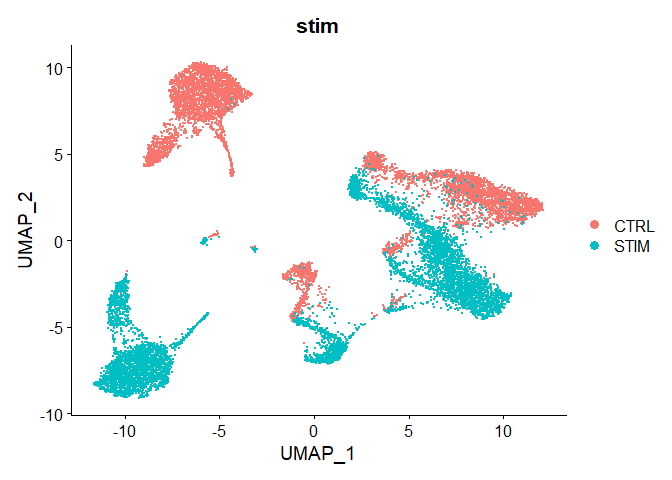
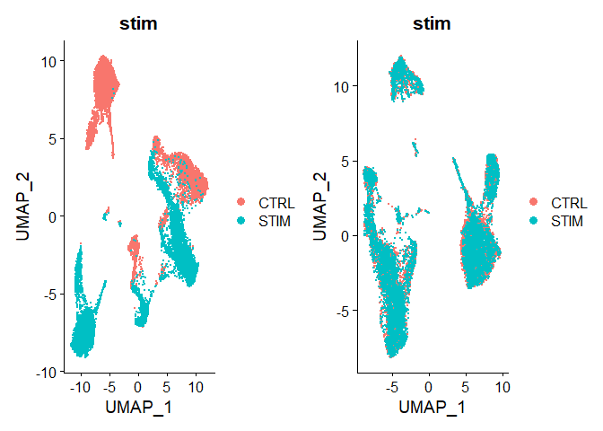
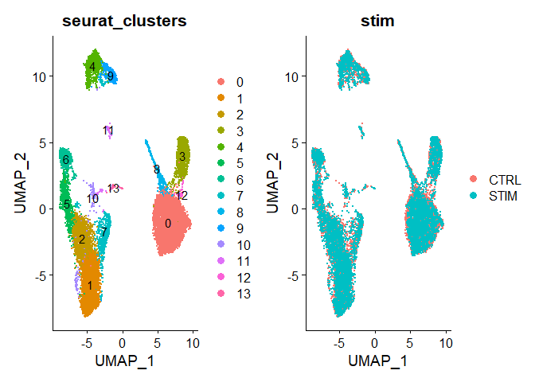
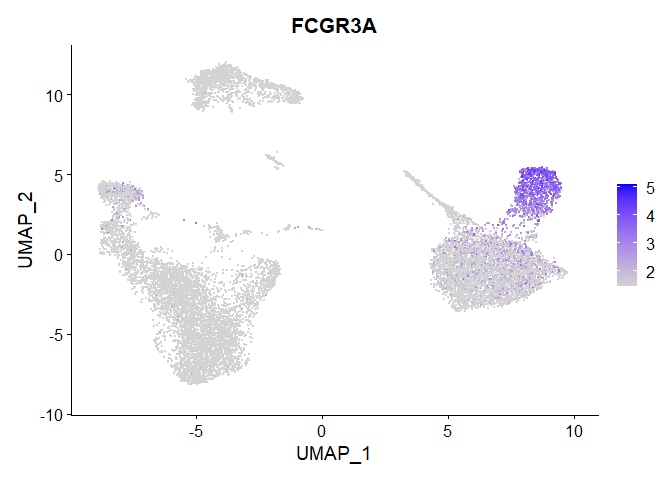
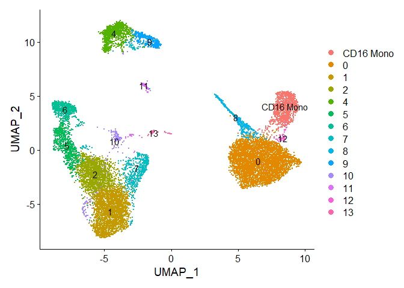
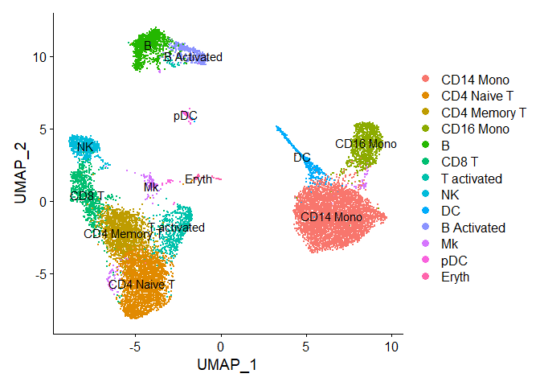
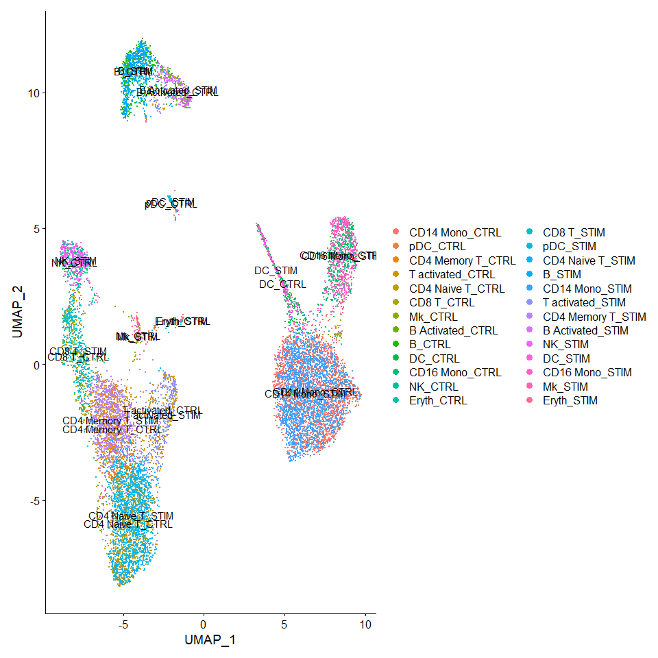
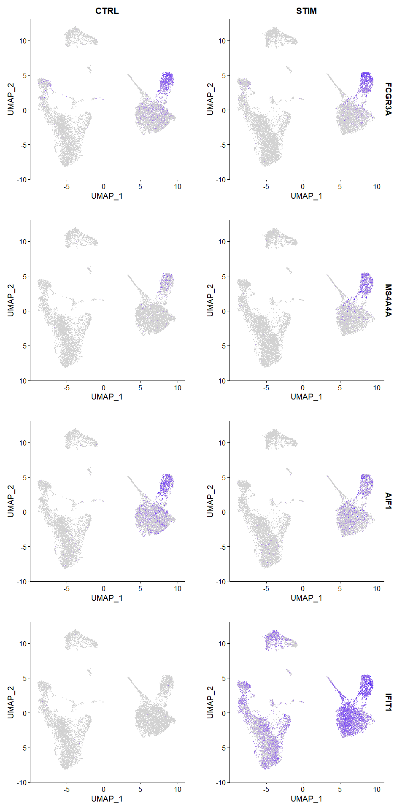

SingleCellAnalysis2
================
JuHyunJeon
2023-05-23

# Single Cell Analysis - Part 2

This single cell analysis follows the YouTube tutorial on single cell
analysis pipeline.

## Import libraries

``` r
library(harmony)
```

    ## Loading required package: Rcpp

``` r
library(Seurat)
```

    ## Attaching SeuratObject

``` r
library(SeuratData)
```

    ## ── Installed datasets ───────────────────────────────────── SeuratData v0.2.2 ──

    ## ✔ ifnb 3.1.0

    ## ────────────────────────────────────── Key ─────────────────────────────────────

    ## ✔ Dataset loaded successfully
    ## ❯ Dataset built with a newer version of Seurat than installed
    ## ❓ Unknown version of Seurat installed

``` r
library(tidyverse)
```

    ## ── Attaching core tidyverse packages ──────────────────────── tidyverse 2.0.0 ──
    ## ✔ dplyr     1.1.2     ✔ readr     2.1.4
    ## ✔ forcats   1.0.0     ✔ stringr   1.5.0
    ## ✔ ggplot2   3.4.2     ✔ tibble    3.2.1
    ## ✔ lubridate 1.9.2     ✔ tidyr     1.3.0
    ## ✔ purrr     1.0.1

    ## ── Conflicts ────────────────────────────────────────── tidyverse_conflicts() ──
    ## ✖ dplyr::filter() masks stats::filter()
    ## ✖ dplyr::lag()    masks stats::lag()
    ## ℹ Use the conflicted package (<http://conflicted.r-lib.org/>) to force all conflicts to become errors

``` r
library(ggplot2)
```

## Integrate Data using Harmony

### What does Harmony do?

Harmony tries to solve the issue of integrating multiple data sets with
different biological difference and technical differences. Unlike other
single cell analysis tools, Harmony takes into account both experimental
and biological factors. Harmony groups cells starting with PCA embedding
and use soft clustering (assigning cells to multiple clusters). Clusters
with disproportionate representation from a small subset of data set is
penalized by the information theoretic metric. After clustering, each
data set has a cluster-specific centroid and Harmony computes
cluster-specific linear correction factors. Harmony learns this linear
correction factor specific to each cells. Harmony will iterate this
process until convergence.

More about Harmony can be found in this
[paper](https://www.biorxiv.org/content/10.1101/461954v2)

### How does it differ from Seurat’s method?

Seurat uses CCA(Canonical Correlation Analysis) and finds anchor points
to integrate datasets. Harmony only gives back the embedding which we
will go over in the following codes.

## Harmony Study Design

Goal of the study: To assess cell-type-specific changes in gene
expression with given treatment

Design: PBMCs from 8 lupus patients split into control and stimulated
group treated with the treatment

Goal of the analysis: to integrate data by conditions, overlay cells
similar in both conditions.

### Install and Load Dataset

``` r
# AvailableData()
# Can give you all the available datasets and the descriptions

# Install dataset
InstallData("ifnb")
```

    ## Warning: The following packages are already installed and will not be
    ## reinstalled: ifnb

``` r
# Load dataset
LoadData("ifnb")
```

``` r
str(ifnb)
```

    ## Formal class 'Seurat' [package "Seurat"] with 13 slots

    ## Warning: Not a validObject(): no slot of name "images" for this object of class
    ## "Seurat"

    ##   ..@ assays      :List of 1
    ##   .. ..$ RNA:Formal class 'Assay' [package "Seurat"] with 8 slots

    ## Warning: Not a validObject(): no slot of name "assay.orig" for this object of
    ## class "Assay"

    ##   .. .. .. ..@ counts       :Formal class 'dgCMatrix' [package "Matrix"] with 6 slots
    ##   .. .. .. .. .. ..@ i       : int [1:9787436] 20 27 37 64 65 83 87 131 139 175 ...
    ##   .. .. .. .. .. ..@ p       : int [1:14000] 0 877 1590 2440 3549 4183 4740 5720 6301 7181 ...
    ##   .. .. .. .. .. ..@ Dim     : int [1:2] 14053 13999
    ##   .. .. .. .. .. ..@ Dimnames:List of 2
    ##   .. .. .. .. .. .. ..$ : chr [1:14053] "AL627309.1" "RP11-206L10.2" "LINC00115" "NOC2L" ...
    ##   .. .. .. .. .. .. ..$ : chr [1:13999] "AAACATACATTTCC.1" "AAACATACCAGAAA.1" "AAACATACCTCGCT.1" "AAACATACCTGGTA.1" ...
    ##   .. .. .. .. .. ..@ x       : num [1:9787436] 1 1 1 1 1 2 1 1 1 1 ...
    ##   .. .. .. .. .. ..@ factors : list()
    ##   .. .. .. ..@ data         :Formal class 'dgCMatrix' [package "Matrix"] with 6 slots
    ##   .. .. .. .. .. ..@ i       : int [1:9787436] 20 27 37 64 65 83 87 131 139 175 ...
    ##   .. .. .. .. .. ..@ p       : int [1:14000] 0 877 1590 2440 3549 4183 4740 5720 6301 7181 ...
    ##   .. .. .. .. .. ..@ Dim     : int [1:2] 14053 13999
    ##   .. .. .. .. .. ..@ Dimnames:List of 2
    ##   .. .. .. .. .. .. ..$ : chr [1:14053] "AL627309.1" "RP11-206L10.2" "LINC00115" "NOC2L" ...
    ##   .. .. .. .. .. .. ..$ : chr [1:13999] "AAACATACATTTCC.1" "AAACATACCAGAAA.1" "AAACATACCTCGCT.1" "AAACATACCTGGTA.1" ...
    ##   .. .. .. .. .. ..@ x       : num [1:9787436] 1 1 1 1 1 2 1 1 1 1 ...
    ##   .. .. .. .. .. ..@ factors : list()
    ##   .. .. .. ..@ scale.data   : num[0 , 0 ] 
    ##   .. .. .. ..@ key          : chr "rna_"
    ##   .. .. .. ..@ var.features : logi(0) 
    ##   .. .. .. ..@ meta.features:'data.frame':   14053 obs. of  0 variables
    ##   .. .. .. ..@ misc         : symbol NULL
    ##   .. .. .. ..@ NA           : NULL
    ##   ..@ meta.data   :'data.frame': 13999 obs. of  5 variables:
    ##   .. ..$ orig.ident        : chr [1:13999] "IMMUNE_CTRL" "IMMUNE_CTRL" "IMMUNE_CTRL" "IMMUNE_CTRL" ...
    ##   .. ..$ nCount_RNA        : num [1:13999] 3017 2481 3420 3156 1868 ...
    ##   .. ..$ nFeature_RNA      : int [1:13999] 877 713 850 1109 634 557 980 581 880 669 ...
    ##   .. ..$ stim              : chr [1:13999] "CTRL" "CTRL" "CTRL" "CTRL" ...
    ##   .. ..$ seurat_annotations: Factor w/ 13 levels "CD14 Mono","CD4 Naive T",..: 1 1 1 12 3 1 7 2 6 1 ...
    ##   ..@ active.assay: chr "RNA"
    ##   ..@ active.ident: Factor w/ 2 levels "IMMUNE_CTRL",..: 1 1 1 1 1 1 1 1 1 1 ...
    ##   .. ..- attr(*, "names")= chr [1:13999] "AAACATACATTTCC.1" "AAACATACCAGAAA.1" "AAACATACCTCGCT.1" "AAACATACCTGGTA.1" ...
    ##   ..@ graphs      : list()
    ##   ..@ neighbors   : list()
    ##   ..@ reductions  : list()
    ##   ..@ project.name: chr "ifnb"
    ##   ..@ misc        : list()
    ##   ..@ version     :Classes 'package_version', 'numeric_version'  hidden list of 1
    ##   .. ..$ : int [1:3] 3 0 0
    ##   ..@ commands    : list()
    ##   ..@ tools       : list()
    ##   ..@ NA          : NULL

### Quality Control and Filter Dataset

``` r
# Calculate mitochondrial RNA percentage
ifnb$percent_mt = PercentageFeatureSet(ifnb, pattern = '^MT-')

# Check your meta data before proceeding
# View(ifnb@meta.data)

ifnb <- subset(ifnb, subset = nCount_RNA > 800 & nFeature_RNA > 200 & percent_mt < 5)
```

### Standard Workflow

``` r
ifnb <- NormalizeData(ifnb)
ifnb <- FindVariableFeatures(ifnb)
ifnb <- ScaleData(ifnb)
```

    ## Centering and scaling data matrix

``` r
ifnb <- RunPCA(ifnb)
```

    ## PC_ 1 
    ## Positive:  TYROBP, C15orf48, FCER1G, CST3, SOD2, TYMP, ANXA5, FTL, CD63, TIMP1 
    ##     CTSB, LGALS1, KYNU, FCN1, APOBEC3A, S100A4, LGALS3, PSAP, NPC2, ANXA2 
    ##     IGSF6, S100A11, LYZ, CD68, SPI1, CTSL, NINJ1, CCL2, SDCBP, HLA-DRA 
    ## Negative:  NPM1, CCR7, LTB, GIMAP7, CD7, CD2, SELL, TRAT1, IL7R, CLEC2D 
    ##     PTPRCAP, ITM2A, IL32, RHOH, RGCC, LEF1, ALOX5AP, CD3G, CREM, PASK 
    ##     MYC, SNHG8, TSC22D3, GPR171, NOP58, BIRC3, CD27, CD8B, SRM, CCL5 
    ## PC_ 2 
    ## Positive:  ISG20, ISG15, IFIT3, IFIT1, LY6E, MX1, TNFSF10, IFIT2, IFI6, RSAD2 
    ##     CXCL10, OAS1, CXCL11, MT2A, IFITM3, IRF7, OASL, IFITM2, TNFSF13B, SAMD9L 
    ##     IDO1, IL1RN, GBP1, CMPK2, DDX58, CCL8, PLSCR1, APOBEC3A, GBP4, FAM26F 
    ## Negative:  IL8, CLEC5A, CD14, VCAN, S100A8, IER3, MARCKSL1, IL1B, PID1, CD9 
    ##     GPX1, PLAUR, INSIG1, PHLDA1, PPIF, THBS1, S100A9, GAPDH, LIMS1, OSM 
    ##     SLC7A11, ACTB, GAPT, CTB-61M7.2, ENG, CEBPB, OLR1, CXCL3, FTH1, MGST1 
    ## PC_ 3 
    ## Positive:  HLA-DQA1, CD83, HLA-DQB1, CD74, HLA-DPA1, HLA-DRA, HLA-DPB1, HLA-DRB1, SYNGR2, IRF8 
    ##     CD79A, MIR155HG, HERPUD1, HLA-DMA, REL, MS4A1, FABP5, TVP23A, HSP90AB1, ID3 
    ##     CCL22, TSPAN13, EBI3, BLNK, TCF4, PRMT1, PMAIP1, NME1, HSPE1, CD70 
    ## Negative:  ANXA1, GIMAP7, CD7, CD2, RARRES3, MT2A, IL32, GNLY, PRF1, CCL2 
    ##     TRAT1, S100A9, RGCC, NKG7, CCL7, CCL5, S100A8, HPSE, CD3G, CTSL 
    ##     CCL8, ITM2A, KLRD1, GZMH, GZMA, OASL, CTSW, CD300E, GPR171, FGFBP2 
    ## PC_ 4 
    ## Positive:  CCR7, LTB, SELL, LEF1, IL7R, ADTRP, TRAT1, PASK, MYC, NPM1 
    ##     SOCS3, TSHZ2, HSP90AB1, TSC22D3, CMTM8, TARBP1, GIMAP7, SNHG8, PIM2, HSPD1 
    ##     CD3G, GBP1, TXNIP, RHOH, C12orf57, CA6, CD27, CMSS1, SESN3, BIRC3 
    ## Negative:  NKG7, GZMB, GNLY, CST7, CCL5, PRF1, CLIC3, KLRD1, GZMH, GZMA 
    ##     APOBEC3G, CTSW, FGFBP2, KLRC1, FASLG, C1orf21, HOPX, CXCR3, SH2D1B, TNFRSF18 
    ##     LINC00996, SPON2, RARRES3, SH2D2A, GCHFR, IGFBP7, ID2, C12orf75, XCL2, S1PR5 
    ## PC_ 5 
    ## Positive:  CCL2, CCL7, CCL8, PLA2G7, LMNA, TXN, S100A9, SDS, CSTB, EMP1 
    ##     CCR1, CAPG, IDO1, MGST1, CCR5, SLC7A11, HSPA1A, LILRB4, VIM, CTSB 
    ##     GCLM, HPSE, FABP5, PDE4DIP, RSAD2, LYZ, CCNA1, CTSL, SGTB, S100A8 
    ## Negative:  VMO1, FCGR3A, MS4A4A, MS4A7, CXCL16, PPM1N, HN1, LST1, SMPDL3A, CDKN1C 
    ##     CASP5, ATP1B3, CH25H, PLAC8, AIF1, SERPINA1, LRRC25, GBP5, CD86, HCAR3 
    ##     RGS19, RP11-290F20.3, VNN2, COTL1, LILRA5, C3AR1, STXBP2, ADA, PILRA, FCGR3B

``` r
ElbowPlot(ifnb)
```

<!-- -->

``` r
ifnb <- RunUMAP(ifnb, dims = 1:20, reduction = 'pca')
```

    ## Warning: The default method for RunUMAP has changed from calling Python UMAP via reticulate to the R-native UWOT using the cosine metric
    ## To use Python UMAP via reticulate, set umap.method to 'umap-learn' and metric to 'correlation'
    ## This message will be shown once per session

    ## 16:42:15 UMAP embedding parameters a = 0.9922 b = 1.112

    ## 16:42:15 Read 13988 rows and found 20 numeric columns

    ## 16:42:15 Using Annoy for neighbor search, n_neighbors = 30

    ## 16:42:15 Building Annoy index with metric = cosine, n_trees = 50

    ## 0%   10   20   30   40   50   60   70   80   90   100%

    ## [----|----|----|----|----|----|----|----|----|----|

    ## **************************************************|
    ## 16:42:17 Writing NN index file to temp file C:\Users\juhyu\AppData\Local\Temp\RtmpwFhOU4\file3b14883789f
    ## 16:42:17 Searching Annoy index using 1 thread, search_k = 3000
    ## 16:42:21 Annoy recall = 100%
    ## 16:42:21 Commencing smooth kNN distance calibration using 1 thread with target n_neighbors = 30
    ## 16:42:22 Initializing from normalized Laplacian + noise (using irlba)
    ## 16:42:22 Commencing optimization for 200 epochs, with 601472 positive edges
    ## 16:42:37 Optimization finished

``` r
p1 <- DimPlot(ifnb, reduction = 'umap', group.by='stim')
p1
```

<!-- -->

``` r
# ifnb <- ifnb %>% 
#   NormalizeData()  %>%
#   FindVariableFeatures() %>%
#   ScaleData() %>%
#   RunPCA()
```

### Run Harmony to integrate the cells

This follows the harmony vignette.

``` r
ifnb_harmony <- ifnb   %>%
  RunHarmony(group.by.vars = 'stim', plot_convergence = FALSE)
```

    ## Harmony 1/10

    ## Harmony 2/10

    ## Harmony 3/10

    ## Harmony 4/10

    ## Harmony 5/10

    ## Harmony 6/10

    ## Harmony 7/10

    ## Harmony converged after 7 iterations

    ## Warning: Invalid name supplied, making object name syntactically valid. New
    ## object name is Seurat..ProjectDim.RNA.harmony; see ?make.names for more details
    ## on syntax validity

``` r
#ifnb_harmony@reductions

ifnb_har_embed <- Embeddings(ifnb_harmony, "harmony")
ifnb_har_embed[1:10, 1:10]
```

    ##                   harmony_1  harmony_2  harmony_3   harmony_4    harmony_5
    ## AAACATACATTTCC.1 11.5256980 -0.9254929  1.8251178  0.06702957 -0.311446310
    ## AAACATACCAGAAA.1 12.0917015 -2.4363789 -2.7053021  0.39913724  1.575922297
    ## AAACATACCTCGCT.1  9.6696367 -2.5603979 -0.3305006  0.85222409 -0.498527426
    ## AAACATACCTGGTA.1 -0.8562419  1.9108115 13.2664992 -5.82861590  1.211469614
    ## AAACATACGATGAA.1 -7.1155529 -0.1131048 -1.3843934  2.55951503  0.169659288
    ## AAACATACGGCATT.1  9.4204852 -3.1479218 -3.1700925  0.87323723  0.157419430
    ## AAACATACTGCGTA.1 -7.8899039 -0.2129049  2.2515506  1.93271224  2.184227944
    ## AAACATACTGCTGA.1 -8.7613199  0.3046028 -2.4887983  3.37668759  0.766935338
    ## AAACATTGAGTGTC.1 -7.6231991  1.8939291  3.8307154 -2.90534995  0.003614181
    ## AAACATTGCTTCGC.1 11.1962161 -3.5171341 -3.5861006  1.65643005  0.910523457
    ##                    harmony_6  harmony_7  harmony_8  harmony_9   harmony_10
    ## AAACATACATTTCC.1   0.2291965  0.1745366  0.1864257 -0.1990987  -1.59781871
    ## AAACATACCAGAAA.1  -0.7872812 -2.6025073  1.6815533  4.6541062   1.96584426
    ## AAACATACCTCGCT.1   1.3078368 -0.8100375  0.9142335  1.1985521  -0.81291129
    ## AAACATACCTGGTA.1   3.5832517  5.8607272 -1.8870716 -3.3373197 -12.20658893
    ## AAACATACGATGAA.1   0.4239258  0.9127832  0.4545552 -0.9606712   0.04245319
    ## AAACATACGGCATT.1   2.7207767 -1.0608047  0.3625427 -3.0554239   2.44335495
    ## AAACATACTGCGTA.1 -10.9517523 -1.4158999  0.2847004 -3.3118310   0.58389341
    ## AAACATACTGCTGA.1   1.1331864  1.5947388  0.8076205  0.6034321  -1.76024155
    ## AAACATTGAGTGTC.1  -0.7707343 -2.3032530  1.3630230  1.2421211   1.64001538
    ## AAACATTGCTTCGC.1   1.5123655 -1.3614488  0.9186108 -0.1972910   1.70209428

### Do UMAP and clustering using Harmony embeddings

``` r
ifnb_harmony <- ifnb_harmony %>%
  RunUMAP(reduction = "harmony", dims = 1:20) %>%
  FindNeighbors(reduction = "harmony", dims = 1:20) %>%
  FindClusters(resolution = 0.5)
```

    ## 16:43:06 UMAP embedding parameters a = 0.9922 b = 1.112

    ## 16:43:06 Read 13988 rows and found 20 numeric columns

    ## 16:43:06 Using Annoy for neighbor search, n_neighbors = 30

    ## 16:43:06 Building Annoy index with metric = cosine, n_trees = 50

    ## 0%   10   20   30   40   50   60   70   80   90   100%

    ## [----|----|----|----|----|----|----|----|----|----|

    ## **************************************************|
    ## 16:43:07 Writing NN index file to temp file C:\Users\juhyu\AppData\Local\Temp\RtmpwFhOU4\file3b146665b7
    ## 16:43:07 Searching Annoy index using 1 thread, search_k = 3000
    ## 16:43:12 Annoy recall = 100%
    ## 16:43:12 Commencing smooth kNN distance calibration using 1 thread with target n_neighbors = 30
    ## 16:43:13 Initializing from normalized Laplacian + noise (using irlba)
    ## 16:43:14 Commencing optimization for 200 epochs, with 606032 positive edges
    ## 16:43:29 Optimization finished
    ## Computing nearest neighbor graph
    ## Computing SNN

``` r
p2 <- DimPlot(ifnb_harmony, reduction = "umap",  group.by = "stim")
p1 + p2
```

<!-- -->
We have successfully integrated using Harmony

## Find Markers and Cluster Identification

- FindMarkers(): This function does best when you want to get which
  genes differentiate the most between two clusters.

- FindAllMarkers(): This function is best when you want to compare
  between one cluster vs all the other clusters and give the genes that
  are differentially expressed.

- FindConservedMarkers(): This function finds markers conserved across
  conditions.

### Find Markers

``` r
p3 <- DimPlot(ifnb_harmony, reduction = "umap", group.by = "seurat_clusters", label = TRUE)
p4 <- DimPlot(ifnb_harmony, reduction = "umap", group.by = "stim")
p3 + p4
```

<!-- -->

``` r
# Default has to be RNA
DefaultAssay(ifnb_harmony)
```

    ## [1] "RNA"

``` r
# DefaultAssay(ifnb_harmony) <- "RNA"

FindAllMarkers(ifnb_harmony,
               logfc.threshold = 0.25,
               min.pct = 0.1,
               only.pos = TRUE,
               test.use = "DESeq2",
               slot = "counts")
```

    ## Calculating cluster 0

    ## Calculating cluster 1

    ## Calculating cluster 2

    ## Calculating cluster 3

    ## Calculating cluster 4

    ## Calculating cluster 5

    ## Calculating cluster 6

    ## Calculating cluster 7

    ## Calculating cluster 8

    ## Calculating cluster 9

    ## Calculating cluster 10

    ## Calculating cluster 11

    ## Calculating cluster 12

    ## Calculating cluster 13

    ## Warning: No DE genes identified

    ## Warning: The following tests were not performed:

    ## Warning: When testing 0 versus all:
    ##  Please install DESeq2 - learn more at https://bioconductor.org/packages/release/bioc/html/DESeq2.html

    ## Warning: When testing 1 versus all:
    ##  Please install DESeq2 - learn more at https://bioconductor.org/packages/release/bioc/html/DESeq2.html

    ## Warning: When testing 2 versus all:
    ##  Please install DESeq2 - learn more at https://bioconductor.org/packages/release/bioc/html/DESeq2.html

    ## Warning: When testing 3 versus all:
    ##  Please install DESeq2 - learn more at https://bioconductor.org/packages/release/bioc/html/DESeq2.html

    ## Warning: When testing 4 versus all:
    ##  Please install DESeq2 - learn more at https://bioconductor.org/packages/release/bioc/html/DESeq2.html

    ## Warning: When testing 5 versus all:
    ##  Please install DESeq2 - learn more at https://bioconductor.org/packages/release/bioc/html/DESeq2.html

    ## Warning: When testing 6 versus all:
    ##  Please install DESeq2 - learn more at https://bioconductor.org/packages/release/bioc/html/DESeq2.html

    ## Warning: When testing 7 versus all:
    ##  Please install DESeq2 - learn more at https://bioconductor.org/packages/release/bioc/html/DESeq2.html

    ## Warning: When testing 8 versus all:
    ##  Please install DESeq2 - learn more at https://bioconductor.org/packages/release/bioc/html/DESeq2.html

    ## Warning: When testing 9 versus all:
    ##  Please install DESeq2 - learn more at https://bioconductor.org/packages/release/bioc/html/DESeq2.html

    ## Warning: When testing 10 versus all:
    ##  Please install DESeq2 - learn more at https://bioconductor.org/packages/release/bioc/html/DESeq2.html

    ## Warning: When testing 11 versus all:
    ##  Please install DESeq2 - learn more at https://bioconductor.org/packages/release/bioc/html/DESeq2.html

    ## Warning: When testing 12 versus all:
    ##  Please install DESeq2 - learn more at https://bioconductor.org/packages/release/bioc/html/DESeq2.html

    ## Warning: When testing 13 versus all:
    ##  Please install DESeq2 - learn more at https://bioconductor.org/packages/release/bioc/html/DESeq2.html

    ## data frame with 0 columns and 0 rows

``` r
# Find Conserved markers, lets say you want to compare 3 vs all the others

cluster3_marker <-FindConservedMarkers(ifnb_harmony,
                                       ident.1 = 3,
                                       grouping.var = "stim")
```

    ## Testing group CTRL: (3) vs (0, 11, 2, 7, 1, 4, 5, 10, 9, 8, 6, 12, 13)

    ## For a more efficient implementation of the Wilcoxon Rank Sum Test,
    ## (default method for FindMarkers) please install the limma package
    ## --------------------------------------------
    ## install.packages('BiocManager')
    ## BiocManager::install('limma')
    ## --------------------------------------------
    ## After installation of limma, Seurat will automatically use the more 
    ## efficient implementation (no further action necessary).
    ## This message will be shown once per session

    ## Testing group STIM: (3) vs (5, 11, 1, 4, 0, 7, 2, 9, 6, 8, 10, 12, 13)

``` r
head(cluster3_marker)
```

    ##           CTRL_p_val CTRL_avg_log2FC CTRL_pct.1 CTRL_pct.2 CTRL_p_val_adj
    ## FCGR3A  0.000000e+00        3.461701      0.977      0.207   0.000000e+00
    ## MS4A4A  0.000000e+00        2.216974      0.582      0.027   0.000000e+00
    ## MS4A7   0.000000e+00        3.064847      0.957      0.203   0.000000e+00
    ## CXCL16  0.000000e+00        2.346339      0.949      0.243   0.000000e+00
    ## VMO1    0.000000e+00        4.388838      0.831      0.067   0.000000e+00
    ## LST1   7.305468e-299        2.340408      0.932      0.258  1.026637e-294
    ##        STIM_p_val STIM_avg_log2FC STIM_pct.1 STIM_pct.2 STIM_p_val_adj
    ## FCGR3A          0        4.042953      0.985      0.131              0
    ## MS4A4A          0        3.188196      0.902      0.078              0
    ## MS4A7           0        3.405656      0.993      0.225              0
    ## CXCL16          0        2.832123      0.920      0.154              0
    ## VMO1            0        4.383909      0.708      0.024              0
    ## LST1            0        2.293781      0.887      0.201              0
    ##             max_pval minimump_p_val
    ## FCGR3A  0.000000e+00              0
    ## MS4A4A  0.000000e+00              0
    ## MS4A7   0.000000e+00              0
    ## CXCL16  0.000000e+00              0
    ## VMO1    0.000000e+00              0
    ## LST1   7.305468e-299              0

``` r
FeaturePlot(ifnb_harmony, features = c("FCGR3A"), min.cutoff = "q10")
```

<!-- -->

We want to rename cluster3 because FCGR3A gene represents cd16 monocytes

``` r
Idents(ifnb_harmony)[20:40]
```

    ## AAACGCTGACCTTT.1 AAACGCTGCAGTTG.1 AAACGCTGCCTAAG.1 AAACGCTGCGTTGA.1 
    ##                7                5                2                1 
    ## AAACGCTGCTGACA.1 AAACGCTGGATAAG.1 AAACGCTGGGACAG.1 AAACGCTGGGGATG.1 
    ##                9                1                0                0 
    ## AAACGCTGGGTTTG.1 AAACGCTGTAGCGT.1 AAACGCTGTGCTAG.1 AAACGCTGTTCCAT.1 
    ##                5                4                9                2 
    ## AAACGGCTAGAGTA.1 AAACGGCTAGTACC.1 AAACGGCTCTTCGC.1 AAACGGCTGGTCAT.1 
    ##                0                1                8                7 
    ## AAACGGCTTACTCT.1 AAACGGCTTCTCTA.1 AAACTTGACCTGAA.1 AAACTTGACTCTTA.1 
    ##                3                0                0                6 
    ## AAACTTGACTGAGT.1 
    ##                4 
    ## Levels: 0 1 2 3 4 5 6 7 8 9 10 11 12 13

``` r
ifnb_harmony <- RenameIdents(ifnb_harmony, "3" = "CD16 Mono")
Idents(ifnb_harmony)[20:40]
```

    ## AAACGCTGACCTTT.1 AAACGCTGCAGTTG.1 AAACGCTGCCTAAG.1 AAACGCTGCGTTGA.1 
    ##                7                5                2                1 
    ## AAACGCTGCTGACA.1 AAACGCTGGATAAG.1 AAACGCTGGGACAG.1 AAACGCTGGGGATG.1 
    ##                9                1                0                0 
    ## AAACGCTGGGTTTG.1 AAACGCTGTAGCGT.1 AAACGCTGTGCTAG.1 AAACGCTGTTCCAT.1 
    ##                5                4                9                2 
    ## AAACGGCTAGAGTA.1 AAACGGCTAGTACC.1 AAACGGCTCTTCGC.1 AAACGGCTGGTCAT.1 
    ##                0                1                8                7 
    ## AAACGGCTTACTCT.1 AAACGGCTTCTCTA.1 AAACTTGACCTGAA.1 AAACTTGACTCTTA.1 
    ##        CD16 Mono                0                0                6 
    ## AAACTTGACTGAGT.1 
    ##                4 
    ## Levels: CD16 Mono 0 1 2 4 5 6 7 8 9 10 11 12 13

``` r
DimPlot(ifnb_harmony, reduction = "umap", label = "T")
```

<!-- -->

``` r
Idents(ifnb_harmony) <- ifnb_harmony$seurat_annotations

DimPlot(ifnb_harmony, reduction = "umap", label = TRUE)
```

<!-- -->

``` r
ifnb_harmony$celltype.cnd <- paste0(ifnb_harmony$seurat_annotations, "_", ifnb_harmony$stim)
Idents(ifnb_harmony) <- ifnb_harmony$celltype.cnd

DimPlot(ifnb_harmony, reduction = "umap", label = TRUE)
```

<!-- -->

``` r
# View(ifnb_harmony@meta.data)
b.treatment.response <- FindMarkers(ifnb_harmony, ident.1 = "CD16 Mono_STIM", ident2 = "CD16 Mono_CTRL")
head(b.treatment.response)
```

    ##         p_val avg_log2FC pct.1 pct.2 p_val_adj
    ## GBP5        0  2.2062511 0.823 0.159         0
    ## FCGR3A      0  3.2860206 0.983 0.198         0
    ## TNFSF10     0  2.4576750 1.000 0.417         0
    ## EDN1        0  1.5520620 0.289 0.009         0
    ## FAM26F      0  2.6930110 0.950 0.208         0
    ## LYPD2       0  0.9769051 0.132 0.001         0

``` r
head(cluster3_marker)
```

    ##           CTRL_p_val CTRL_avg_log2FC CTRL_pct.1 CTRL_pct.2 CTRL_p_val_adj
    ## FCGR3A  0.000000e+00        3.461701      0.977      0.207   0.000000e+00
    ## MS4A4A  0.000000e+00        2.216974      0.582      0.027   0.000000e+00
    ## MS4A7   0.000000e+00        3.064847      0.957      0.203   0.000000e+00
    ## CXCL16  0.000000e+00        2.346339      0.949      0.243   0.000000e+00
    ## VMO1    0.000000e+00        4.388838      0.831      0.067   0.000000e+00
    ## LST1   7.305468e-299        2.340408      0.932      0.258  1.026637e-294
    ##        STIM_p_val STIM_avg_log2FC STIM_pct.1 STIM_pct.2 STIM_p_val_adj
    ## FCGR3A          0        4.042953      0.985      0.131              0
    ## MS4A4A          0        3.188196      0.902      0.078              0
    ## MS4A7           0        3.405656      0.993      0.225              0
    ## CXCL16          0        2.832123      0.920      0.154              0
    ## VMO1            0        4.383909      0.708      0.024              0
    ## LST1            0        2.293781      0.887      0.201              0
    ##             max_pval minimump_p_val
    ## FCGR3A  0.000000e+00              0
    ## MS4A4A  0.000000e+00              0
    ## MS4A7   0.000000e+00              0
    ## CXCL16  0.000000e+00              0
    ## VMO1    0.000000e+00              0
    ## LST1   7.305468e-299              0

``` r
FeaturePlot(ifnb_harmony, features = c("FCGR3A", "MS4A4A", "AIF1", "IFIT1"), split.by = "stim", min.cutoff = "q10")
```

<!-- -->
